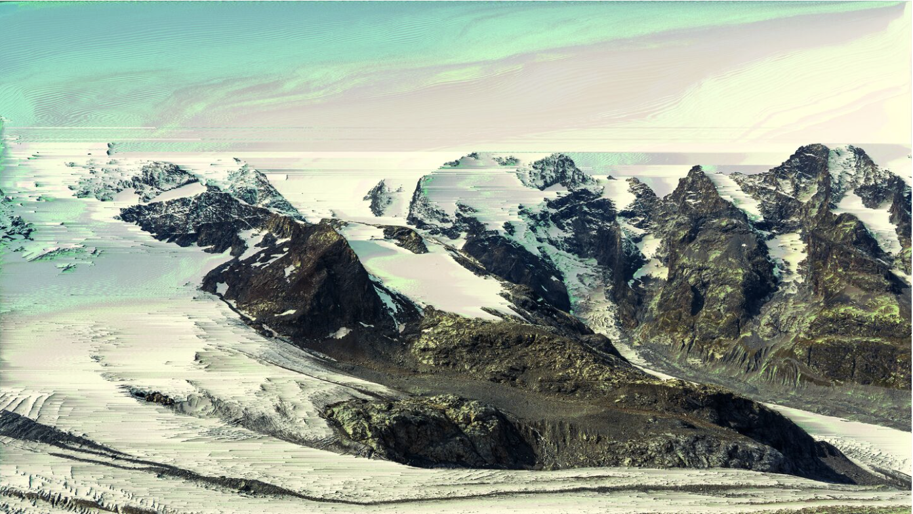
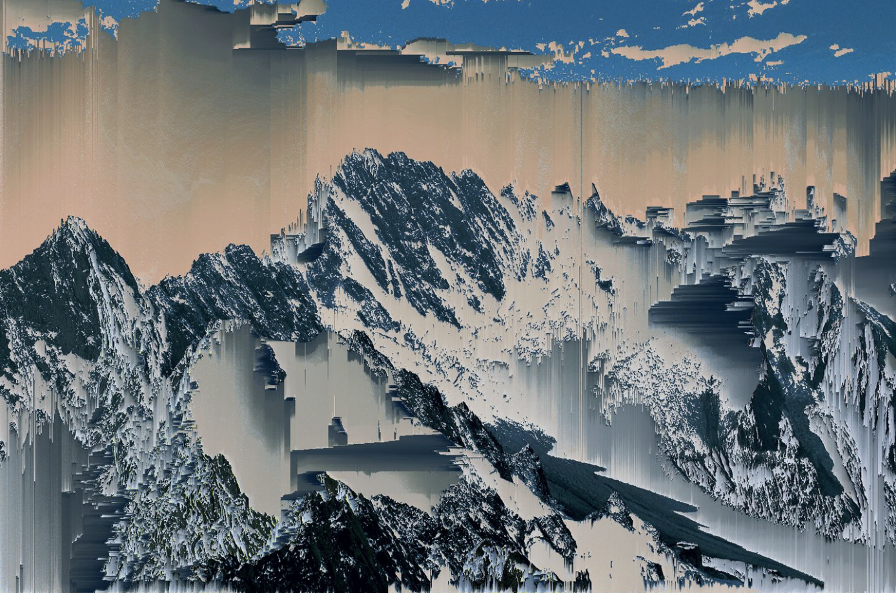
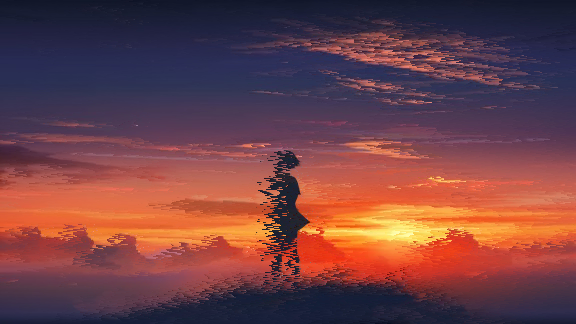
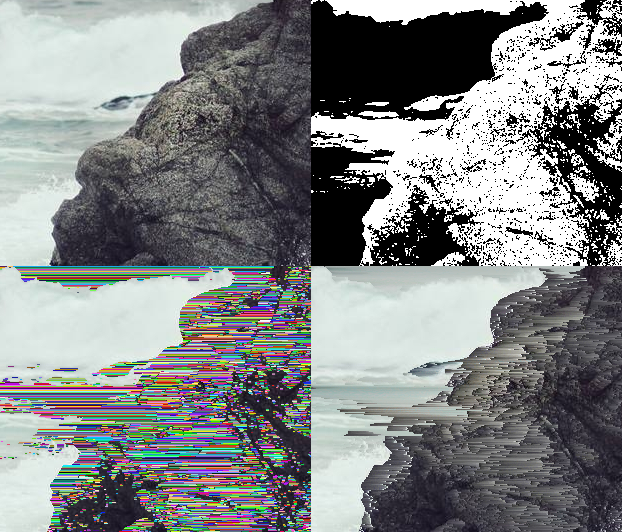

# Angel Huang

# WEEK 8 TUTORIAL
This is my first local change to the repo

# WEEK 8 QUIZ

## Part 1: Imaging Technique Inspiration

An imaging technique that really stood out to me during my research is pixel sorting. Pixel sorting is an "algorithmic glitch art technique" that organizes pixels within an image based on color values such as brightness, hue, or saturation. This results in streaking effects where areas of similar value blur into flowing lines while other areas remain sharp. A key artwork associated with pixel sorting is Kim Asendorf's Mountain Tour (2010), which was a series of mountain images transformed using a custom pixel-sorting algorithm. This is a beneficial technique to incorporate, as it makes the artwork feel more alive and expressive.

### Ipz Abeinnr
#### Kim Asendorf - Digital image, 2010, Piz Bernina, Switzerland

### Mnot Abcin A
#### Kim Asendorf - Digital image, 2010, Mont Blanc, France

---

## Part 2: Coding Technique Exploration

One coding technique that could help implement pixel sorting is the interval-based array sorting technique, made by a user called Satyarth. The program reads pixel data, groups similar pixels into intervals based on color or brightness thresholds, then sorts each interval before writing it back to the image. This will help create the melting glitch effect because some parts of the images remain visible while selected regions are algorithmically rearranged. Using tools such as p5.js or Python will make it easier to access pixel values, apply sorting rules, and experiment with different types of pixel-sorting effects.

**Example code:** [https://github.com/satyarth/pixelsort/](https://github.com/satyarth/pixelsort/)

#### Code Implementation Example #1

#### Code Implementation Example #2

- The top left is the original image.
- The top right is the image with pixels outside the lightness threshold replaced with black, and the rest filled in with white.
- The bottom left is the image with the intervals filled in with random colors – each color represents a different interval.
- On the bottom left is the image with sorted intervals.
##### (Pixel Sorting - Satyarth.me, 2025)

---
## References

- Pixel Sorting - Satyarth.me. (2025). Satyarth.me. [https://satyarth.me/articles/pixel-sorting/](https://satyarth.me/articles/pixel-sorting/)
- What is Pixel Sorting? How It Works, Tools & Examples | Glitchology. (2026). Glitchology. [https://glitchology.com/frequently-asked-questions/what-is-pixel-sorting/](https://glitchology.com/frequently-asked-questions/what-is-pixel-sorting/)
- Zucker, S. (2022). Pixel Sorting: Meeting Chaos Half-Way. Kimasendorf.com. [https://kimasendorf.com/mountain-tour/pixel-sorting-meeting-chaos-half-way/](https://kimasendorf.com/mountain-tour/pixel-sorting-meeting-chaos-half-way/)
- Asendorf, K. (2022). Mountain Tour. Kimasendorf.com. [https://kimasendorf.com/mountain-tour/](https://kimasendorf.com/mountain-tour/)
- satyarth. (2025). GitHub - satyarth/pixelsort: Pixel sorting images in python. GitHub. [https://github.com/satyarth/pixelsort/](https://github.com/satyarth/pixelsort/)
